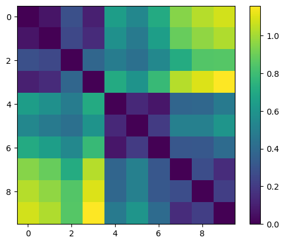

# Week 10: Audio Similarity and Transcription

## Task 1: Similarity
Here is the visualisation of the similarity matrix

By looking at the similarity matrix I have generated, I can see how similar my three chosen pieces of music are. Tracks 0-3 are classical, tracks 4-6 are rock, and tracks 7-9 are my chosen tracks - of which track 7 is folk, track 8 is pop-rock, and track 9 is country-pop. I can see that my three tracks have a very low similarity to the classical tracks, which I expected as they use much different instruments to folk. I can see that the most two similar tracks from my chosen ones are tracks 7 and 9. This surprised me when I initially looked at the similarity reading as they sound quite different to me, but folk and country are quite similar genres which use many of the same instruments such as piano, drums, violins, and guitar - of which piano and guitar are used in both those tracks. These two tracks also contain the same voice, Taylor Swift, which may add to the similarity between all three of my tracks. The two most similar tracks are tracks 3 and 9, with 3 being a classical piece and 9 being a country-pop piece. I expected this result as the genres are so different, and that track 9 uses electronic vocal manipulation and electronic guitar whereas track 3 does not contain these at all. All three of my chosen tracks, despite being different genres, are very similar. I believe this is because they are all songs made by singer-producer Taylor Swift and producer Jack Antonoff whom both have very unique production styles when they work together, that are apparent in all three of these songs despite the fact they sound so different at first listen. I expected tracks 4-6 to be similar to track 8 as they are both rock, but they did not have a high similarity score which I believe to be due to the fact track 8 is also considered a pop song, and is not as dark sounding as tracks 4-6. 

## Task 2: Transcription

This is my original score

This is the updated score after the transcription

Reflecting, I can see that there are many significant changes from the original score and the updated score after the transcription. The updated score is much less accurate than the original one. One change is that the original score has a 4/4 time signature whereas the updated one has a 3/4 time signature, meaning the beats per minute are different for each score. Another change is that the tempo is 102 on the original score, whereas it is 101 on the updated score, therefore the updated score would be played at a slower pace than it should be. On the second line of the score, many notes are missing, which makes the updated score much less accurate after the transcription. A diminuendo on the seventh bar of the original score shows the increase in loudness of the piece, this is where the vice would come in, but the updated score does not have this which shows the song staying the same volume throughout. The transcription of my score has been extremely inaccurate and while the updated score still sounds very similar to the original, crucial notes and pieces of information are missing. 
