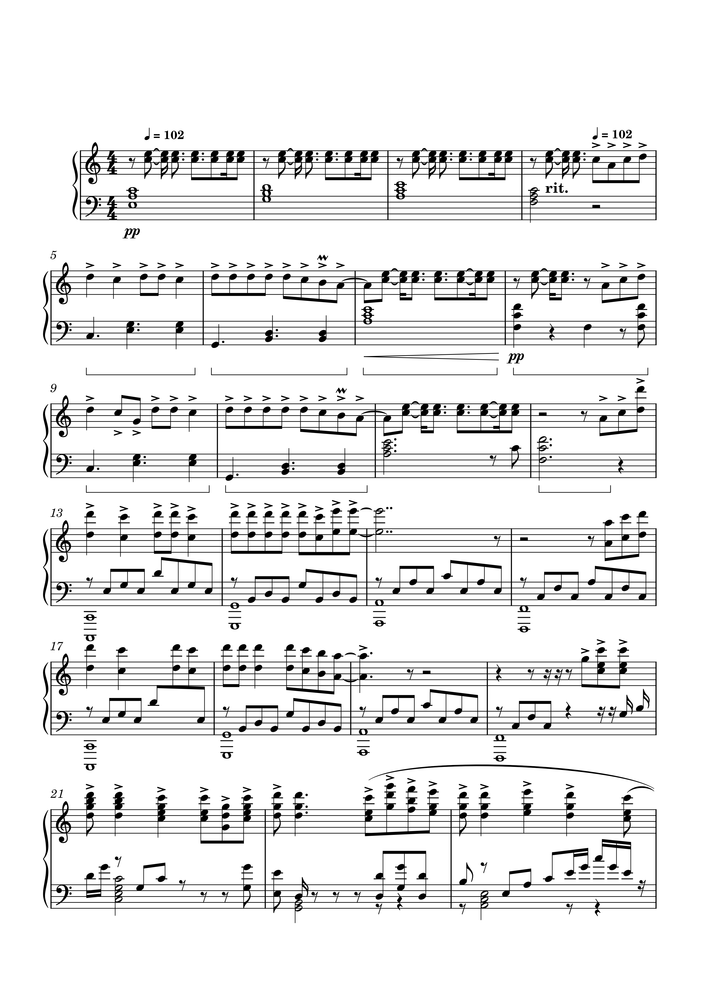
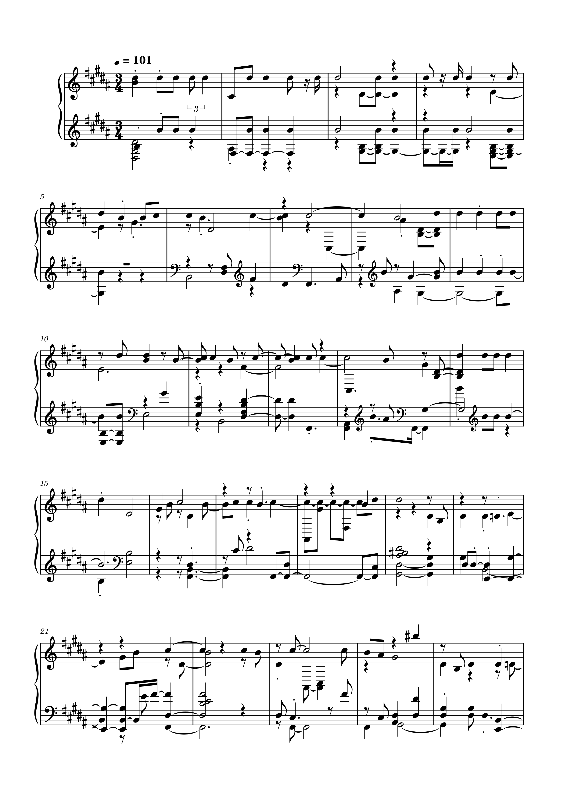

# Week 10: Audio Similarity and Transcription

## Task 1: Similarity
Here is the visualisation of the similarity matrix

## Task 2: Transcription

This is my original score

This is the updated score after the transcription

Reflecting, I can see that there are many significant changes from the original score and the updated score after the transcription. 
