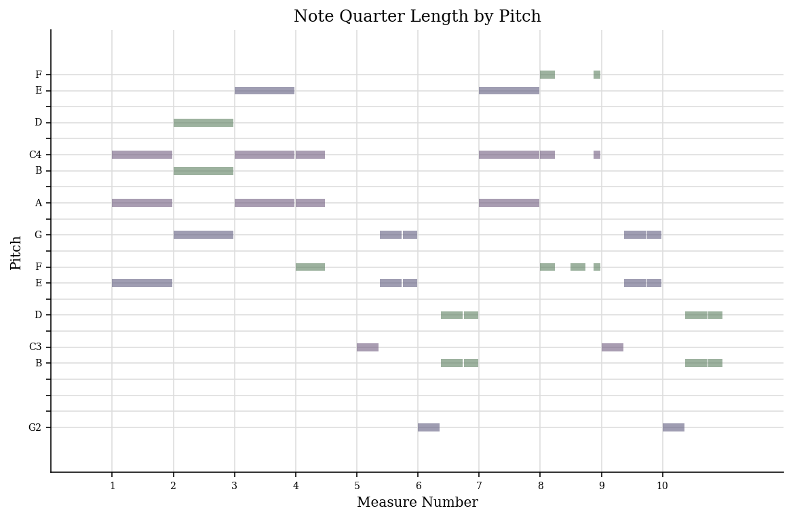
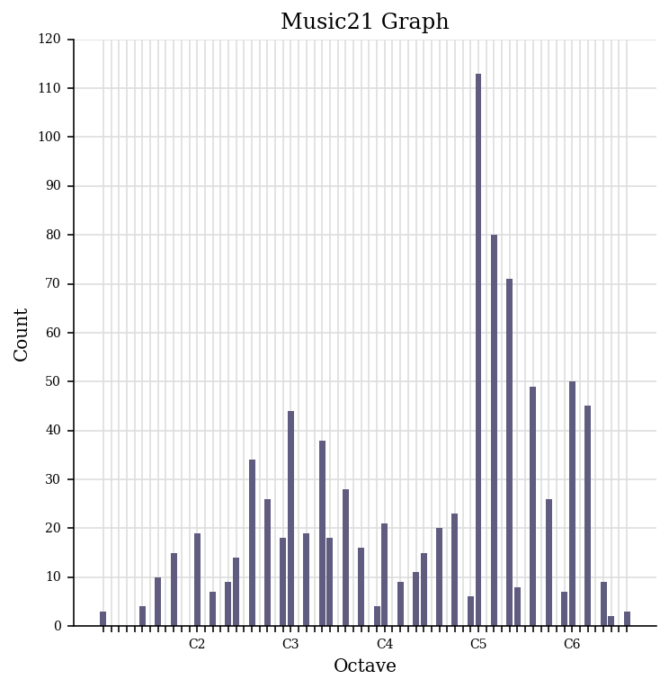

# Week 4

For this week's task, I have generated a piano roll of pitches and a pitch histogram of my piece using Music21.

### Piano roll of pitches 
A piano roll of pitches is a graphical representation of the arrangement of musical notes in a piece of music. Horizontally, it shows time progressing and vertically, it shows the pitch ascending/descending. Each rectangle here represents a note and it is positioned in accordance with its pitch and duration. A piano roll tells me the timing, pitch, and duration of each note on my piece of music, giving me an insight into the composition and structure of the piece. 

### Pitch histogram
A pitch histogram is a visual representation of the distribution of the pitch in a piece pf music. It shows the frequency of each pitch, giving me information about the tone of the piece of music. A pitch histogram tells me about the tonal characteristics of a piece of music, allowing me to analyse the structure. 
 

