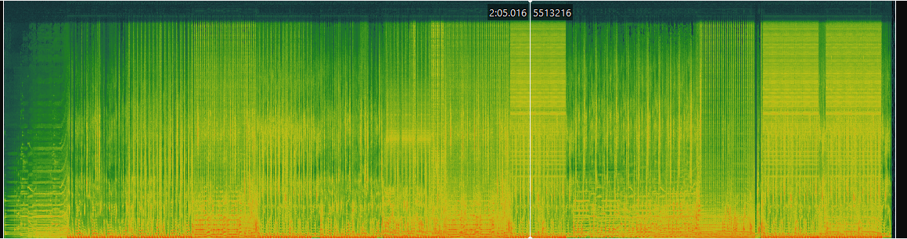
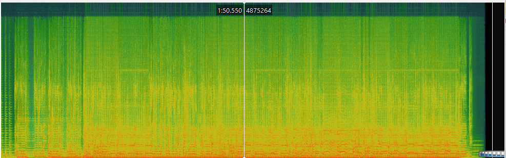
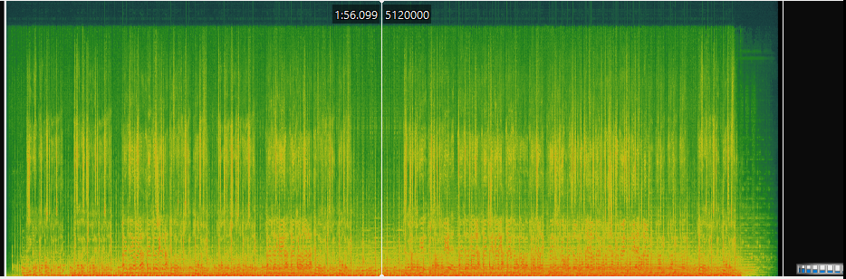

# Week 8: Music as sound

## Task 1: Find and describe 3 audio tracks relating to my theme

| Title                     | Artist                  | Composer                | Copyright Info        | Genre      | Source         | File/Audio Format | Number of Channels | Sample Rate | Bits per Second | Duration |
|---------------------------|-------------------------|-------------------------|-----------------------|------------|----------------|---------------------|---------------------|-------------|------------------|----------|
| Look What You Made Me Do  | Taylor Swift            | Taylor Swift, Jack Antonoff, Fred Fairbrass, Richard Fairbrass, Rob Manzoli | © Taylor Swift, Sony/ATV Music Publishing LLC | Pop        | Album "reputation" | MP3                 | 2                 | 44100 Hz    | 320 kbps         | 3:31     |
| Red (Taylor's Version)    | Taylor Swift            | Taylor Swift            | © Taylor Swift, Sony/ATV Music Publishing LLC | Country    | Album "Red (Taylor's Version)" | FLAC                | 2                 | 48000 Hz    | 24 bits          | 5:42     |
| cardigan                  | Taylor Swift            | Taylor Swift, Aaron Dessner | © Taylor Swift, Sony/ATV Music Publishing LLC | Indie Folk | Album "folklore" | WAV                 | 2                 | 44100 Hz    | 24 bits          | 4:11     |

## Task 2: Analysis of my 3 tracks in SonicVisualiser 

<b> Spectogram for 'Look What You Made Me Do' 

<b> Spectogram for 'Red (Taylor's Version)' 

<b> Spectogram  for 'cardigan' </b>

Time-frequency analysis offers many more advantages than a waveform-based analysis when looking at music curation and analytics. One example of this is that it allows a much more detailed representation of the elements of the piece of music across time and frequency simultaneously. This means that it is much more beneficial for finding small features like a tempo change or an introduction of an instrument that wasn't there before - capturing these subtle changes can provide curators with much more data. Another example of this is that time-frequency analysis is much better at capturing short events within a piece of music, such as specific beats or a new transition, or a new note, etc. This means that the piece can be analysed in a much more enhanced way, enabling music analysers to find small, hidden details that add to the piece. An example of this advantage is in the chromogram of the song 'Red (Taylor's Version)' that is pictured above, where there is a section toward the end of the song that was not present anywhere else except the beginning of the song, a subtle nuance that might not otherwise be captured. 
