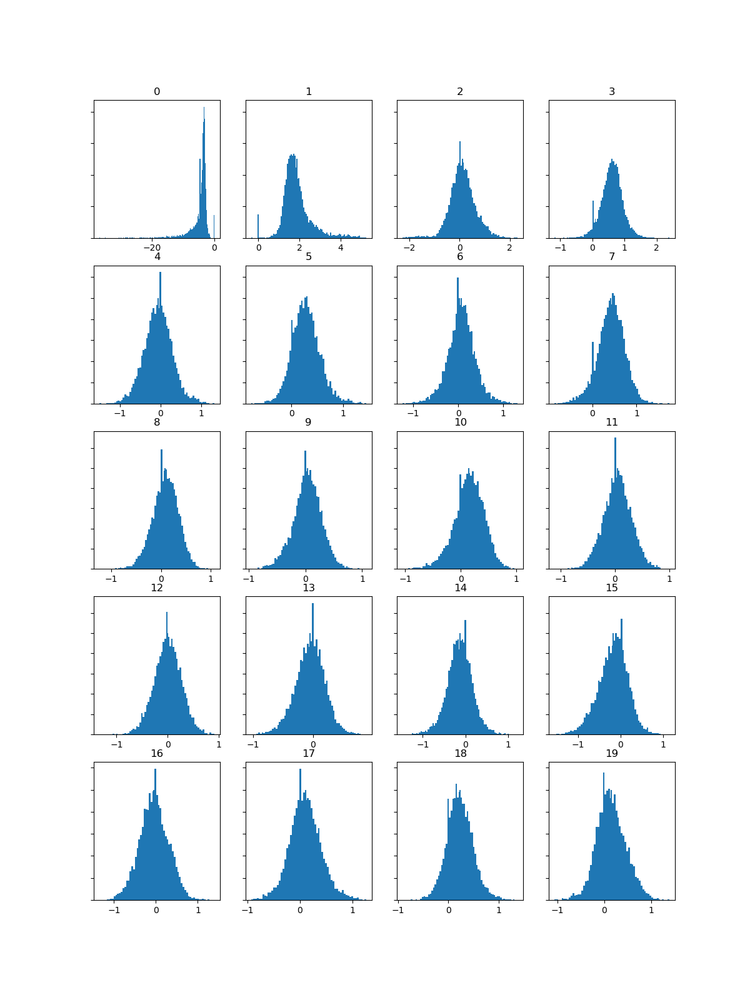

# Week 9: Analysis and Extracting Meaning from Audio 

I chose these three tracks for this analysis because they span three different genres, and therefore have different sounds which allows me to compare and analyse them whilst still keeping with the theme.
- 'Look What You Made Me do' is a dark dance-pop piece.
- 'Red (Taylor's Version' is a country piece.
- 'cardigan' is a folk piece. 

## Task 1: Extract Features
<b> Spectogram, Mel Frequency Cepstral Coefficient, and Chromagram for 'Look What You Made Me Do' 

<b> Spectogram, Mel Frequency Cepstral Coefficient, and Chromagram for 'Red (Taylor's Version)' 

<b> Spectogram, Mel Frequency Cepstral Coefficient, and Chromagram for 'cardigan' 

## Task 2: Compute and visualise features with histograms

<b> Chromagram Histogram for 'Look What You Made Me Do' 

<b> Chromagram Histogram for 'Red (Taylor's Version)' 

<b> Chromagram Histogram for 'cardigan' 

</b>

### Analysis of the histograms
A chromagram is used to analyse the melodies and harmonies of a piece of music, analysing the pitch classes. Using python I have created the hhistogram to show 12 histograms for each pitch class. By looking at the Chromagram feature, I can see many significant differences between the tracks that I had anticipated after listening to each track. On initial thought, I assumed each track would have much similar chromagram results as they are in similar keys - 'Red (Taylor's Version) is in Eb, 'Look What You Made Me Do' is in  A Minor, and 'cardigan' is in Eb. With 'Look What You Made Me Do' and 'cardigan' being in th same genre, it makes sense that the histograms for these songs are very similar, looking almost exactly the same with the exception of a few small changes. With 'Red (Taylor's Version)' being in a different key, the histogram is much different to the other two tracks - it has a few noticeable similarities but is much different to the other two tracks than they are in comparison to each other. Despite being very different genres, 'cardigan' being folk and 'Look What You Made Me do' being pop-rock, it is surprising to me that the hisograms are so similar, but it does make sense after comparing the pitch and key of both songs. With 'Look What You Made Me Do', each histogram is much steeper at the sides than the other tracks - this is because the vocals and instruments on this song are very sharp, and do not lead into each other but almost exist as their own individual note/word - which is clearly shown here when comparing it to the other tracks which histograms rise and fall much more smoothly. 
