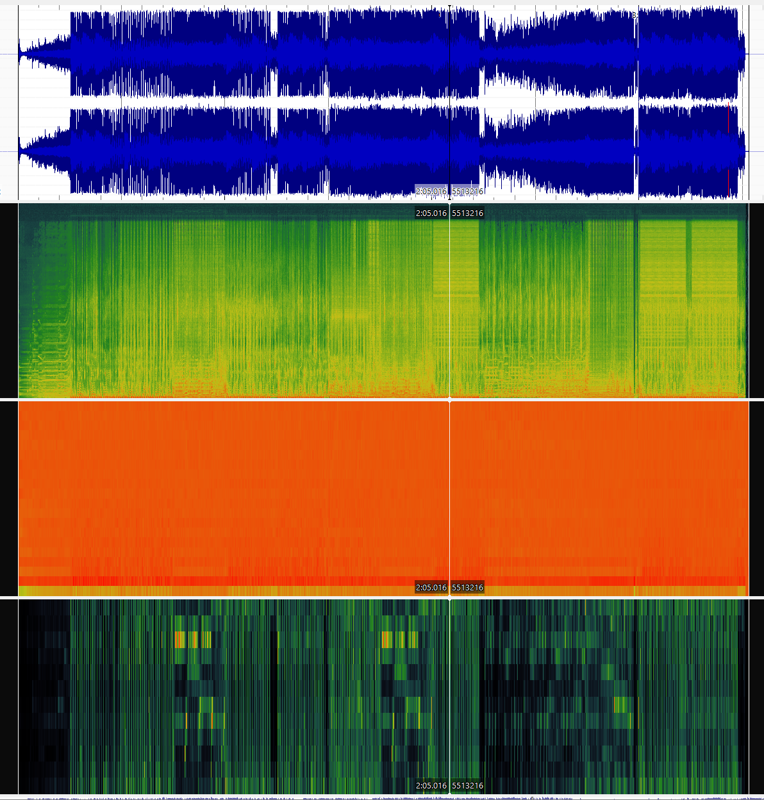

# Week 9: Analysis and Extracting Meaning from Audio 

I chose these three tracks for this analysis because they span three different genres, and therefore have different sounds which allows me to compare and analyse them whilst still keeping with the theme.
- 'Look What You Made Me do' is a dark dance-pop piece.
- 'Red (Taylor's Version' is a country piece.
- 'cardigan' is a folk piece. 

<b> Spectogram, Mel Frequency Cepstral Coefficient, and Chromagram for 'Look What You Made Me Do' 

<b> Spectogram, Mel Frequency Cepstral Coefficient, and Chromagram for 'Red (Taylor's Version)' 

<b> Spectogram, Mel Frequency Cepstral Coefficient, and Chromagram for 'cardigan' 

